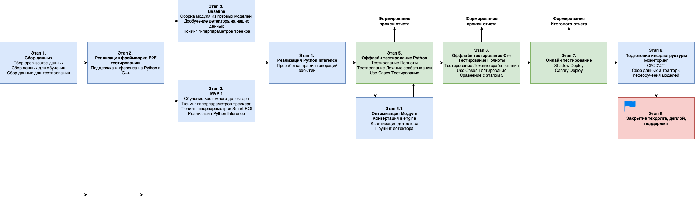
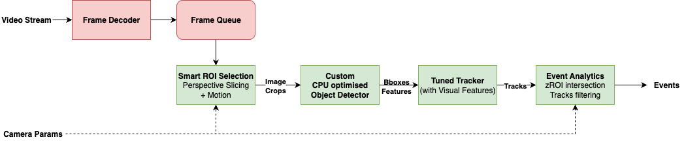
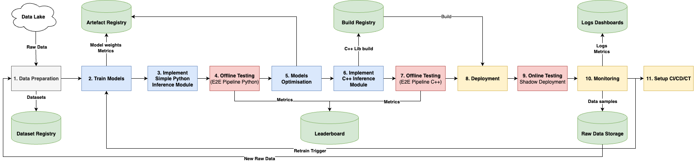

# ML System Design Document
Модуль Охраны Периметра MVP v1

## Описание задачи
Необходимо разработать программный модуль для системы видеонаблюдения, предназначенный для автоматического контроля различных охраняемых территорий - промышленных объектов, складов, частных владений, государственных зон и т.д. Модуль работает с видеопотоками от камер, установленных по периметру охраняемой территории, преимущественно в уличных условиях.

Цель модуля - в реальном времени обнаруживать факт проникновения в заранее определённую охраняемую зону, сформировать тревожное событие и оперативно уведомить службы безопасности для своевременного реагирования.

Программное обеспечение должно быть интегрировано в существующую систему видеонаблюдения и работать на доступных вычислительных ресурсах. Разработчики могут рекомендовать оптимальные варианты развёртывания инфраструктуры.

Модуль предполагается использовать в нерабочее время - пользователь может задавать расписание его работы. Когда модуль включён, он должен фиксировать и сигнализировать о любом появлении посторонних объектов в охраняемой зоне, при этом если в один и тот же момент присутствует несколько объектов, достаточно сформировать один тревожный сигнал.

Также в некоторых случаях камеры видимого спектра могут дублироваться тепловизорами; их синхронизация не требуется.

## Виды событий / нарушений
* **Подозрительное поведение  людей рядом с охраняемой зоной**  
  Видеосъемка, слишком долгое нахождение в кадре, подозрительные позы, скрытное передвижение
* **Пересечение людьми охраняемой зоны**  
  Шагом, бегом, перекатами, ползком и другими формами скрытного передвижения
* **Пересечение транспортного средства охраняемой зоны**

## Термины
**Целевой объект** - нарушитель охраняемого периметра: траснспортное средство (легковая машина, мотоцикл, велосипед, грузовик) или человек \
**RGB камера** - камера видимого спектра \
**IR (Infra-Red)** камера - тепловизор \
**Зона события (zROI)** - zone Region of Interest полигон, задаваемый для каждой камеры вручную при установке. Охраняемая зона, при попадании целевого объекта в которую, должна вызываться тревога
**Подозрительное поведение** - человек задерживается подозрительно долго около охраняемого объекта, ведет видеосъемку или фотосъемку местности, скрытное перемещение, попытка спрятаться \
**DORI стандарт** - стандарт для видеоаналитики [DORI stands for Detect, Observe, Recognise, Identify](https://wedosecurity.co.za/cctv-cameras/dori-standard/) \
**MP** - MegaPixels, единица измерения разрешения матрицы камеры \
**ТС** - скоращенное от Транспортное Средство \
**AMX** - Advanced Matrix Extensions, расширенные матричные инструкции процессоров Intel для эффективных матричных вычислений (для ускорения AI инференса) [ссылка на wiki](https://en.wikipedia.org/wiki/Advanced_Matrix_Extensions) \
**SLA** - Service Level Agreement, формальный договор между заказчиком услуги и ее поставщиком, содержащий описание услуги, права и обязанности сторон и, самое главное, согласованный уровень качества предоставления данной услуги \
**ПО** - Программное обеспечение \
**Confidence Threshold** - это минимальный уровень уверенности модели, при котором она считает свой результат достаточно надёжным, чтобы выдать его как ответ \
**MOT** - Multiple Object Tracking - задача треккинга нескольких объектов \

## 1. Цели и предпосылки
## 1.1 Зачем идем в разработку
* Нужно вовремя обнаружать и предотвращать проникновение на охраняемый периметр посторонних личностей
* Объект большой, камер много, сложно держать охране в фокусе все камеры без автоматизации

## 1.2 Бизнес требования и ограничения
**Ограничения:**
* Камеры: RGB + IR, 0.3-8MP
* сервера с CPU и AMX инструкциями. 80 камер, два сервера. (Можно обсуждать улучшение железа)
* Минимальные размеры людей: 50 пикселей на метр (по DORI)

**Функциональные требования:**
* Система должна уметь работать как с RGB, так и IR камерами
* Система должна уметь детектировать людей в кадре
* Система должна обнаружать людей в любой позе (скрытное перемещение, шаг, бег, кувырок)
* Система должна на одного нарушителя формировать одно событие
* Система должна обнаруживать факт входа в zROI человеком или ТС
* Система должна формировать событие при нарушении периметра
* В системе должна быть поддержка задания любого полигона zROI
* Система должна предоставить визуализацию события для подтверждения и проверки охраной (id камеры и снапшот)
* Система должна вести учет событий
* Система должна поддерживать добавление новых камер
* Система должна предупреждать отдельным событием об подозрительном поведении людей около зоны
* Модуль подозрительного поведения может быть отключен на некоторых камерах
* Система не должна реагировать на животных
* Модуль должен работать в любое время суток
* Систему можно отключать полностью в рабочее время

**Нефункциональные требования:**
* Recall целевых событий **>95%**
* Меньше **4 ложных тревог** на оператора за смену в одной локации
* Время на сработку тревоги **<5 секунд**
* Latency ML модуля должен обеспечивать выполнение SLA < 5 сек. Допустимое значение latency будет определено после построения baseline и измерений, но ориентир — **≤ 200–300 ms на детектор**
* Вес Mодели **≤ 150 MB**, inference **≤ 2 GB RAM** на один поток

**Бизнес метрики:**
* Time To Detect / Time To Response - время требуемое для сработки тревоги с момента появления целевого объекта в кадре
* True Alarm Rate (Recall) - отношение количества обнаруженных событий модулем к количеству всех целевых событий
* False Alarm Rate (Precision) - отношение количества ложных срабатываний к общему количеству срабатываний
* Затраты на сотрудников службы безопасности - зарплаты сотрудников, стоимость проверки событий
* Поддерживаемое количество камер на один сервер
* Время на настройку новой камеры (при добавлении новой камеры, физическая настройка камеры)
* Время на выкатку обновления (при добавлении новой камеры, обновление ПО/дообучение моделей, если нужно)

## 1.3. Что входит и что не входит в скоп проекта (первая стадия)
* Входит: обнаружение людей в зоне интереса
* Не входит: обнаружение ТС в зоне интереса
* Не входит: определение подозрительного поведения
* Не входит: распознавание на [4K кадрах](https://en.wikipedia.org/wiki/4K_resolution)

## 1.4. Предпосылки решения
* Большое количество камер (80+), просмотр вручную требует большого количества операторов
* Операторам тяжело ночами сидеть и мониторить обстановку
* Охрана часто игнорирует сигналы тревоги из-за слишком большого количества FP у текущего решения
* Текущее решение практически не находит события на тепловизорах
* Текущее решение неудовлетворительно обнаруживает нарушителей в нестандартных позах
* Нужно повышать доверие к системе со стороны охраны
* Текущий модуль не приспособлен для работы с камерами с большим фокусным расстоянием

## 2. Методология
### 2.1. Постановка задачи
**ML задача:** \
Object Detection + Multiple-Object Tracking (MOT) + Zone-based Event Detection \
(+ VideoAnalytics в будущем)

### 2.2. Блок-схема решения

### 2.2.1. Блок-схема решения с этапами разработки
<!--  -->

### 2.2.2. Архитектура ML модуля
**Бейзлайн:**
* Классический подход detection (YOLOv11n) + tracker (ByteTrack) - основная работа на детекторе  

**MVPv1:**
* Детектор архитектурно оптимизированный под CPU инференс
* Tracking First - детектор срабатывает реже, вся работа на треккере
* Smart ROI selection - для повышения Recall на маленьких объектах бьем на тайлы входной кадр с разным разрешением вдали и вблизи   

### 2.2.3. Архитектура MLOps

1. **Data Preparation**  
   Open Source датасеты, Data Mining, Разметка и авторазметка, Dataset Verification, Версионирование, Разделение на train, val и test. Сохранение датасетов в `Dataset Registry`
2. **Train Models**  
   Обучение, Валидация, Выбор лучшего чекпоинта, Сохранение логов и весов в `Artefact Registry`, Воспроизводимость, Distributed Training, Оптимизация Гиперпараметров
3. **Implement Simple Python Inference Module**  
   Реализация простого python инференса для оценки точности модуля до всех оптимизаций
4. **Offline Testing (E2E Pipeline Python)**  
   Тестирование e2e и stage-wise Python пайплайна (отдельно детектор, отдельно треккинг и тд) на архивных данных (тестовом датасете). Сохранение метрик в `Leaderboard`
5. **Models Optimisation**  
   Конвертация в inference engine для CPU инференса, квантизация, прунинг (опционально), дистиляция (опционально). Сохранение модели в `Artefact Registry`
6. **Implement C++ Inference Module**  
   Реализация C++ кода инференса для встраивания в прод. Сборка билда, сохранение билда в `Build Registry`
7. **Offline Testing (E2E Pipeline C++)**  
   Тестирование e2e и stage-wise C++ пайплайна (отдельно детектор, отдельно треккинг и тд) на архивных данных (тестовом датасете). Тот же код, что и для **шага 4**. Сохранение метрик в `Leaderboard`
8. **Deployment**  
   Деплой модуля на целевое железо. Настройка камер
9. **Online Testing Shadow Deployment**  
   Онлайн тестирование модуля. Shadow Deployment (на одних и тех же данных гоняем старую версию и новую версию, оцениваем разницу). Использование инстуремнтов из A/B тестирования для статзначимой оценки качества. Ручная валидация результатов.
10. **Monitoring**  
   Data drift detection, model drift detection. Логирование статистик, метрик использования ресурсов в `Logs Dashboards`. Отбор потенциально полезных данных полуавтоматически или на основе ***Human In The Loop*** для будущих обучений и тестов.
11. **Setup CI/CD/CT (Опционально)**  
   Настройка Continuous Integration, Continuous Delivery, Continuous Training. Настройка триггера переобучения модели. Автообучение модели. Оптимизация процессов.

## 2.3. Этапы решения

### 2.3.0. EDA
Jupyter Notebook с EDA: [ссылка]('../notebooks/human_detection_eda.ipynb')

**Готовые third-party данные:**
| Датасет     | Год  | Размер (изобр. / видео)     | Кол-во bbox | Сцены            | Модальность | Аннотации                     | Особенности                       | Ссылка |
|-------------|------|-----------------------------|-------------|------------------|-------------|-------------------------------|-----------------------------------|--------|
| CrowdHuman  | 2018 | 24k изображений             | ~470k       | Разнообразные    | RGB         | Full-body, visible-body, head | Экстремальная плотность, окклюзии | [ссылка](https://www.crowdhuman.org) |
| WiderPerson | 2019 | 13k изображений             | ~400k       | Разнообразные    | RGB         | Full-body                     | Большой разброс масштабов         | [ссылка](https://github.com/WHU-LIESMARS/WiderPerson) |
| CUHK-SYSU   | 2016 | 18k изображений             | ~96k        | Улица            | RGB         | bbox + tracking               | Классический person search        | [ссылка](https://www.ee.cuhk.edu.hk/~xgwang/CUHK_SYSU.html) |
| MOTSynth    | 2021 | 1.3M кадров                 | ~40M        | Синтетика, город | RGB         | bbox + tracking + mask        | Синтетика, идеальные аннотации    | [ссылка](https://github.com/vision4robotics/MOTSynth) |
| FLIR        | 2018 | 14k изображений             | ~80k        | Видеорегистратор | IR          | bbox                          | Тепловизионные данные             | [ссылка](https://www.flir.com/oem/adas/adas-dataset-form) |
| LLVIP       | 2021 | 15k пар                     | ~300k       | CCTV, Ночь       | RGB + IR    | bbox                          | Выравненные RGB–IR пары           | [ссылка](https://github.com/bupt-ai-cz/LLVIP) |
| M3FD        | 2022 | 4k изображений              | ~30k        | Улица            | RGB + IR    | bbox                          | Небольшой, но чистый датасет      | [ссылка](https://github.com/JinyuanLiu-CV/M3FD) |
| PANDA       | 2020 | 45k изображений             | ~1M         | CCTV, Улица      | RGB         | bbox + tracking               | Сверхвысокое разрешение           | [ссылка](https://www.panda-dataset.com) |
| MOT17       | 2017 | 11 видео                    | ~300k       | Улица            | RGB         | bbox + tracking               | Стандартный MOT benchmark         | [ссылка](https://motchallenge.net/data/MOT17) |
| MOT20       | 2020 | 8 видео                     | ~250k       | CCTV             | RGB         | bbox + tracking               | Стандартный MOT benchmark         | [ссылка](https://motchallenge.net/data/MOT20) |
| STCrowd     | 2019 | 6k видео                    | ~1M         | CCTV             | RGB + IR    | bbox + tracking               | Multimodal Dataset детекции людей |[ссылка](https://4dvlab.github.io/STCrowd/index.html) |
| VFP290k     | 2022 | 290k кадров                 | ~5M         | Улица, CCTV      | RGB         | bbox                          | Упавшие люди                      | [ссылка](https://github.com/VFP290k/VFP290k) |
| VisDrone    | 2018 | 10k видео + 55k изображений | ~2.5M       | Фото с дрона     | RGB         | bbox + tracking               | Экстремально малые объекты        | [ссылка](https://github.com/VisDrone/VisDrone-Dataset) |

**Внутренние данные:**
| Название данных                 | Есть ли данные в компании | Требуемый ресурс для получения данных | Качество проверено | Размер                | Особенности           |
| ------------------------------- | ------------------------- | ------------------------------------- | ------------------ | --------------------- | --------------------- |
| Данные с наших CCTV камер улиц  | StreetViewsHumanDet       | готов                                 | да                 | ~23k изображений      | 5 доменов. Люди в обычных позах |
| Видео с завода                  | PS1                       | готов                                 | да                 | 215 видео (<2 минуты) | 80 камер. Разные ракурсы, расстояния и скрытое перемещение |
| Видео с аэропорта               | нет                       | DE/Data Annotator/DS                  | нет                | -                     | Люди в специформе |
| Видео с воинской части          | PS3                       | Data Annotator/DS                     | нет                | 70 видео (<2 минуты)  | Скрытое перемещение |
| Видео с охраняемых домов        | PS4                       | готов                                 | да                 | 20 видео (<2 минуты)  | Люди в обычных позах |
| Видеопоток с целевых объектов   | нет                       | DE/Data Annotator/DS                  | нет                | ∞                     | Бесконечный поток данных, но нужно правильно фильтровать |

**Выводы:**
* Большая часть open source данных - люди в обычных позах на городских улицах в хорошем разрешении
* Некоторые датасеты состоят из видео - последовательности очень похожих друг на друга кадрах. Для обучений детектора лучше прореживать их, чтобы не вносить bias, и не учиться на похожих кадрах
* Достаточно хорошее разнообразие для генерелезации моделей на детекцию людей в общем
* Не хватает разнообразия в позах людей, особенно в IR спектре.
* Недостаточно примеров со скрытным перемещением
* Нужно больше локаций со специфичными сценами (промышленная зона, пустыри, природа)
* Есть козырь в виде доступа к бесконечному потоку данных с реальных камер. Этим нужно пользоваться и инвестировать время в автоотбор данных при мониторинге и продумыванием алгоритмов майнинга

### 2.3.1. Подготовка и сбор данных

#### Описание данных и сущностей
Датасеты:
* Third-Party Датасеты изображений с bbox-ами людей в RGB и IR спектрах
* Third-Party Датасеты видео с MOT разметкой людей в RGB и IR спектрах (разметка формата MOT)
* Наши готовые датасеты изображений с bbox-ами людей в RGB и IR спектрах с CCTV камер улиц, помещений и тд
* Наши готовые датасеты видео с MOT разметкой людей в RGB и IR спектрах (разметка формата MOT)
* Датасеты с видео проникновений людей в охраняемую зону с разметкой треков нарушителей и охраняемых зон

Сырые данные:
* Видео с CCTV камер в режиме реального времени. Не размеченные, с возможными артефактами, большую часть времени на кадрах ничего не происходит

#### Потенциальные риски и проблемы доступных данных
* Качество изображений и видео на внутренних датасетах могут быть посредственные из-за некачественной настройки камер
* Артефакты видеопотоков
* Не хватает разнообразия в позах людей, особенно в IR спектре
* Недостаточно примеров со скрытным перемещением (лежа, ползком, спринт, комуфляж)
* Сдвиг по распределнию между third-party данными, синтетическими данными и целевыми данными
* Несбалансированность данных (люди в обычных позах намного чаще встречаются, чем лежащие или сидячие, не говоря о кувыркающихся)
* Сложность сбора данных. Процесс сложный, медленный, ручной и неудобный

#### Описание процесса генерации данных
* Камеры с разных объектов транслируют видеопоток постоянно и сохраняется в архив. Архив хранится 14 дней, после чего "протухшие" видео удаляются
* Для каждого клиента храним маппинг camera_id -> split, чтобы при расширений датасетов не было ликов данных (видео с одной камеры попадали в разные сплиты)
* Для сбора данных: в интерфейсе продукта вручную нужно выбрать камеры, выделить участки видео, которые нас интересуют и скачать эти видео
* Дальше просмотр DSом видео, переконвертация с фиксом артефактов и загрузка на cloud
* Разметка данных в LabelStudio
   * Подгрузка данных из облака в LabelStudio (ML engineer)
   * Формирование задачи на разметку с ТЗ и скриптами валидации разметки (ML engineer + Data Annotation Lead)
   * Авторазметка с помощью моделей (ML engineer)
   * Проверка и исправление разметки вручную разметчиками с `кросс-валидацией` (каждый сэмпл разметки размечается минимум 3 разметчиками)  (Data Annotators)
   * Оценка качества разметки скриптами. Анализ и исправление примеров с маленьким `agreement score` (меньше порога) (Data Annotation Lead + Data Annotators)
   * Финальная проверка менеджером разметки (Data Annotation Lead)
   * Выгрузка размеченных данных, конвертация в MOT-like формат. Деление на train/val/test по `camera_id -> split` маппингу (ML engineer)
* Загрузка датасетов в ClearML для версионированного хранения
* Процесс нерегулярный, иницируется по инициативе DS

#### Если данных недостаточно: способы решения и сколько ещё нужно
* Проведение экспериментов на существующих данных для оценки зависимости влияния количества данных на метрики моделей
* Тестирование модели на Use Cases датасетах
* Если метрики не устраивают и эксперименты демонстрируют рост метрик при добавлении данных - постепенно собираем данные в прироритете на Use Cases, которые у нас проседают.

#### Конфиденциальность
* Данные должны храниться во внутреннем защищенном хранилище, так как данные чувствительные

#### Необходимый результат этапа
`Результат этапа: Готовы версионированные датасеты хранящиеся в ClearML с EDA скриптами. Датасеты разбиты на train/val/test без утечек`

### 2.3.2. Подготовка моделей

#### Описание ML-метрик и функций потерь
**ML метрики:**
* Object Detection
   * AP@50 - Average Precision при пороге IoU=0.5 ([описание](https://cocodataset.org/#detection-eval)), стандартная метрика детекции, не зависит от порога Confidence Threshold (удобно для валидации), порог IoU=0.5 (нам важно просто обнаружить объект, нет необходимости детектировать границы человека очень точно)
   * F1@50 - F1 score с фиксированным порогом Confidence Threshold и IoU=0.5 (Более интуитивно понятная и близкая к бизнесу метрика, используем ближе к концу, когда подобрали оптимаьный Confidence Threshold на валидации). Очень чувствительна к порогу
* MOT
   * DetA ([описание](https://miguel-mendez-ai.com/2024/08/25/mot-tracking-metrics)). Нас особо не интересует IDSW, как просто уверенно обнаружить людей несколько кадров подряд
   * IDF1 ([описание](https://miguel-mendez-ai.com/2024/08/25/mot-tracking-metrics)). Метрика дополнительная, которая учитывает Assignment, для понимания общего качества треккинга
* Функция потерь: сильно зависит от архитектуры детектора.

#### Описание схемы ML-валидации
* Разбиваем датасет по camera_id на train/val/test, чтобы не было ликов
* Тестовый датасет - holdout датасет, разбиваем на UseCases

#### Описание структуры бейзлайна
1. На вход приходит видеопоток
2. Видеопоток декодирует фреймы и складывает в очередь в отдельном потоке
3. В другом потоке модуль аналитики достает изображения из очереди и подает на вход моделям
4. Сначала детектор YOLOv11n (хороший бейзлайн по скорости и точности) детектирует людей
5. Детекции со временем объединяются в треки треккером ByteTrack (быстрый, простой и качественный треккер для бейзлайна)
6. Модуль бизнес логики анализирует треки на предмет попадания в охраняемую зону. Если объект находится в зоне больше определенного количества времени - формируем событие тревоги

#### Стратегии дальнейшего развития решения
* Детектор YOLOv11n - не оптимален с точки зрения эффективности инференса на CPU, стоит рассмотреть более оптимальные варианты, заточенные под CPU
* Очень важно правильно настроить гиперпараметры треккера на валидационной выборке
* Ресурсы на вычисления ограничены, а кадр может быть большим, стоит ресерчить эффективные аналоги инференса на тайлах
* Рассмотреть варианты добавления детектора движения, чтобы сделать ансамбль
* Возможно потребуется дополнительный классификатор человека для борьбы с ложными срабатываниями

#### Анализ и интерпретация работы модели
* Анализ работы модели будет проводиться в репозитории с e2e тестированием
* Предполагается реализовать анализ метрик на срезах (в разных use cases, например погодные условия, позы и тд)
* Построение визуализации e2e предсказаний, чтобы удобнее было глазами оценивать результат работы и презентовать его заказчику

#### Риски данного этапа, и способы их снижения
* Ошибки в разметке. Минимизация через скрипты валидации разметки, ручную проверку разметки и cross-annotation несколькими разметчиками
* Недостаточная обобщающая способность решения. Расширение тестового датасета, формирование Use Cases тестовых датасетов.
* Жесткие ограничения по железу могут не позволить разработать решение с желаемой точностью.

#### Необходимый результат этапа
`Результат этапа: выстроен план реализации и развития модуля`

### Этап 2.3.2. Реализация e2e тестирования
* Git репозиторий с иммитацией инференса моделей на тестовых датасетах
* E2E тестирование c подсчетом метрик на различных этапах (детекция, треккинг, бизнес логика)
* Тестер работает одинаково с API python инференса и C++ инференса
* Результаты воспроизводимы и логируются в ClearML
* По результату тестирования формируется REPORT, который сохраняется в лидерборд с тегами
* Оценка метрик в разрезе Use Cases

`Результат этапа: работащий и протестированный репозиторий для E2E оценки точности будущих модулей`

### Этап 2.3.3.1. Реализация бейзлайна
* Создание бейзлайна из готовых обученных моделей YOLOv11n из ultralytics, bytetrack
* Реализация базовой бизнес логики
* Конвертация весов в ONNX

`Результат этапа: бейзлайн из готовых моделей, python инференс onnx`

### Этап 2.3.3.2. MVP
* Реализация версионированного, распределенного и воспроизводимого пайплайна обучения детектора
* Перебор различных архитектур детектора
* Обучение кастомного детектора
* Подбор оптимальных аугментаций
* Оптимизация гиперпараметров детектора
* Анализ доступных треккеров
* Оптимизация гиперпараметров трекера на валидационных датасетах
* Конвертация весов в ONNX

`Результат этапа: пайплайн обучения детектора, onnx python инференс из обученных моделей`

### Этап 2.3.4. Реализация Python инференса
* Полировка python инференса кандидата
* Адаптация бизнес логики
* Встраивание кода в пайплайн E2E тестирования

`Результат этапа: python инференс кандидата встроен в пайплайн тестирования`

### Этап 2.3.5. Оффлайн тестирование Python модуля
* Прогон Python инференса через E2E пайплайн тестирования на архивных тестовых датасетах
* Генерация отчета с e2e метриками, метриками по этапам и по Use Cases
* Анализ результатов тестирования

`Результат этапа: кандидат прошел e2e тестирование. Получены метрики. Отчет сохранен в Report Registry` \
Синхронизация с ProductOwner. Презентация предварительных результатов

### Этап 2.3.5.1. Оптимизация модуля
* Модификация архитектуры модели (при необходимости)
* Квантизация модели (при необходимости)
* Прунинг модели (при необходимости)
* Дистиляция модели (при необходимости)
* Конвертация весов в ONNX
* Встраивание оптимизированной модели в python инференс

`Результат этапа: Получена оптимизированная версия Python Inference`

### Этап 2.3.6. Оффлайн тестирование C++ модуля
* Перенос python инференса на C++ инференс
* Встраивание C++ модуля в e2e pipeline тестирования
* Прогон C++ инференса через E2E пайплайн тестирования на архивных тестовых датасетах
* Генерация отчета с e2e метриками, метриками по этапам и по Use Cases
* Анализ результатов тестирования
* Оценка скорости работы решения

`Результат этапа: кандидат прошел e2e тестирование C++ модуля. Получены метрики. Отчет сохранен в Report Registry` \
Синхронизация с ProductOwner. Презентация предварительных результатов

### Этап 2.3.7. Онлайн тестирование
* Встраивание C++ модуля в библиотеку и подготовка сборки билда
* Сохранение билда в BUILD REGISTRY
* Деплой кандидата на 2 недели параллельно с текущим решением (Shadow Deployment). Сбор статистик. Результаты работы билда кандидата не показываются пользователю
* Анализ полученных результатов по событиям и технических характеристик билда кандидата в сравнении с текущим решением
* Формирование и логирование отчета

`Результат этапа: билд кандидат успешно прошел онлайн тестирование. Билд кандидат показал результаты лучше, чем текущий кандидат` \
Синхронизация с ProductOwner. Презентация результатов. Принятие решения о выкатке нового билда в продакшен

### Этап 2.3.8. Подготовка инфраструктуры.
* Настройка Мониторинга
   * Data drift мониторинг
   * Model dirft мониторинг
   * Настройка логирования
   * Отбор данных для ручной проверки с целью будущей интеграции в датасеты обучения или тестирования
* Настройка CI/CD/CT. Выбор тригера переобучения модели
`Результат этапа: билд полностью готов к деплою` \
Синхронизация с ProductOwner.

### Этап 2.3.9. Финал
* Деплой новой версии продукта
* Закрытие техдолга по кодовой базе

`Результат этапа: новая версия выкатилась в прод. Мониторинг работает и формирует триггер переобучения. Закрытие основной фазы разработки проекта. Переход к поддержке`

## 3. Подготовка пилота

### Механизм проведения пилота - Shadow deployment (3 недели)
1. Выбираем камеры 30 из 80 тремя группами (10 + 10 + 10). Стратификация камер по ракурсу, типу сцен, исторически проблемных камер
2. Выделаем дополнительный сервер на вычисления
3. Деплоим билд с новым модулем на дополнительный сервер
4. На каждую неделю берем новую группу камер
   1. Видеопоток с выбранных камер дублируем на дополнительный сервер
   2. Новый и старый модули обрабатывают в real-time потоки с камер и логируют все промежуточные результаты в архив
   3. Анализ метрик точности и производительности после пройденной недели
   4. Rollback (ранняя остановка пилота), если критерии **rollback** выполнены
5. Завершение пилота и подведение итогов на базе критерив **успеха**

### 3.1. Способ оценки пилота
**Метрики точности модуля**
1. Regression Testing
   1. Распределяем Events_old, Envents_new на TP_old, FP_old, TP_new, FP_new - для нового и старого модулей (ивенты без дублей)
   2. DUP_old, DUP_new - число дубликатов событий для нового и старого модуля
   3. MISS_new (regression) - сколько TP событий обнаружено только старым модулем
   4. GAIN_new (increment) = сколько TP событий обануржено только новым модулем
   5. TTD_new, TTD_old - сколько времени потребовалось на детекцию с момента появления объекта
2. FN sampling
   1. Бьем все данные на случайные небольшие окна (по 30 секунд) суммарно не менее 3 часа. Учитываем стратификацию по ракурсу и типу сцен
   2. Размечаем окна (человек есть/нет)
   3. Считаем **оценку** recall по этим окнам
3. ***Optional***: если релиз большой - размечаем все видосы полностью (раз в год)

**Метрики производительности модуля**
1. Latency (min/mean/max)
2. Потребление памяти
3. Количество поврежденных/дропнутных кадров видеопотока

### 3.2. Что считаем успешным пилотом
**Критерии rollback (достаточно хотя бы одного)**
* MISS_new / TP_old > 10%
* FP_new/hour > 1.5 FP_old/hour
* FP/hour > 40 - верхняя граница пользовательской терпимости
* P95 TTD_new > 5 секунд (95ый персентиль)

**Критерии успеха (должны быть выполнены все)**
* Regression: MISS_new / TP_old ≤ 1%
* Improvement:
   * GAIN_new > 0
   * FP_new/hour ≤ FP_old/hour
   * Recall_new > Recall_old + 2% (оценки из FN sampling), 2% - для минимизации влияния случайности
* DUP_new ≤ DUP_old
* Latency:
   * P95 TTD_new ≤ P95 TTD_old
   * average TTD_new ≤ 5 секунд
* Вес Mодели ≤ 150 MB

### 3.3. Подготовка пилота
Оценка ожидаемой вычислительной сложности
1. Производим оценку вычислительной сложности нового модуля и старого в shadow-режиме. Логируем:
   1. CPU utilization
   2. memory usage
   3. inference time per frame
   4. frames dropped
2. Оценка
   1. Сравнение старого и нового модуля по системным характеристикам
   2. Оценка средних значений и персентильных на соответствие критериям успеха
3. В случае превышения допустимых вычислительных ограничений: корректировка параметров пилота
   1. Пробуем менять: параметры модели (resolution, FPS, batching, thresholds)
   2. Пробуем временно уменьшить число камер/сервер
   3. Оптимизация детектора людей (quantization, pruning, замена архитектуры)
