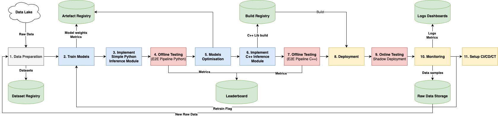
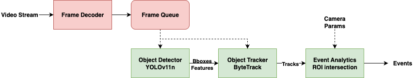

# ML System Design Document
Модуль Охраны Периметра MVP v1

## Термины
**Целевой объект** - нарушитель охраняемого периметра (ТС или человек) \
**RGB камера** - камера видимого спектра \
**IR (Infra-Red)** камера - тепловизор \
**Зона события (ROI)** - Region of Interest полигон, задаваемый для каждой камеры вручную при установке. Зона при попадании целевого объекта, в которой \
**Подозрительное поведение** - человек задерживается подозрительно долго около охраняемого объекта, ведет видео- или фото-съемку местности, скрытное перемещение, попытка спрятаться \
**DORI стандарт** - стандарт для видеоаналитики [DORI stands for Detect, Observe, Recognise, Identify](https://wedosecurity.co.za/cctv-cameras/dori-standard/)

**События:**
* **Подозрительное поведение  людей рядом с охраняемой зоной**  
  Видеосъемка, слишком долгое нахождение в кадре, подозрительные позы, скрытное передвижение
* **Пересечение людьми охраняемой зоны**
* **Пересечение транспортного средства охраняемой зоны**

## 1. Цели и предпосылки
## 1.1 Зачем идем в разработку
* Нужно вовремя обнаружать и предотвращать проникновение на охраняемый периметр посторонних личностей
* Объект большой, камер много, сложно держать охране в фокусе все камеры без автоматизации

## 1.2 Бизнес требования и ограничения
Ограничения:
* Камеры: rgb + тепловизоры, 0.3-8MP
* сервера с CPU и AMX инструкциями. 80 камер, два сервера. (Можно обсуждать улучшение железа)
* Минимальные размеры людей: 50 пикселей на метр (по DORI)

Функциональные требования:
* Система должна уметь работать как с RGB, так и IR камерами
* Система должна уметь детектировать людей в кадре
* Система должна обнаружать людей в любой позе (скрытное перемещение, шаг, бег, кувырок)
* Система должна на одного нарушителя формировать одно событие
* Система должна обнаруживать факт входа ROI человеком или ТС
* Система должна формировать событие при нарушении периметра
* В системе должна быть подержка задания любого полигона ROI
* Система должна предоставить визуализацию события для подтверждения и проверки охраной (id камеры и снапшот)
* Система должна вести учет событий
* Система должна поддерживать добавление новых камер
* Система должна предупреждать отдельным событием об подозрительном поведении людей около зоны
* Модуль подозрительного поведения может быть отключен на некоторых камерах
* Система не должна реагировать на животных
* Модуль должен работать в любое время суток
* Систему можно отключать полностью в рабочее время

Нефункциональные требования:
* Recall целевых событий **>95%**
* Меньше **4 ложных тревог** на оператора за смену в одной локации
* Время на сработку тревоги **<5 секунд**
* Latency ML модуля должен обеспечивать выполнение SLA < 5 сек. Допустимое значение latency будет определено после построения baseline и измерений, но ориентир — **≤ 200–300 ms на детектор**
* Вес Mодели **≤ 150 MB**, inference **≤ 2 GB RAM** на один поток

Бизнес метрики:
* Time To Detect / Time To Response
* True Alarm Rate (Recall)
* False Alarm Rate (Precision)
* Затраты на охрану
* Поддерживаемое количество камер на один сервер
* Время на настройку новой камеры
* Время на выкатку обновления

## 1.3. Что входит и что не входит в скоп проекта (первая стадия)
* Входит: обнаружение людей в зоне интереса
* Не входит: обнаружение ТС в зоне интереса
* Не входит: определение подозрительного поведения
* Не входит: распознавание на 4к кадрах

## 1.4. Предпосылки решения
* Большое количество камер (80+), просмотр вручную требует большого количества операторов
* Операторам тяжело ночами сидеть и мониторить обстановку
* Охрана часто игнорирует сигналы тревоги из-за слишком большого количества FP у текущего решения
* Текущее решение практически не находит события на тепловизорах
* Текущее решение неудовлетворительно обнаруживает нарушителей в нестандартных позах
* Нужно повышать доверие к системе со стороны охраны
* Текущий модуль не приспособлен для работы с камерами с большим фокусным расстоянием

## 2. Методология
### 2.1. Постановка задачи
**ML задача:** \
Object Detection + Multi-Object Tracking (MOT) + Zone-based Event Detection \
(+ VideoAnalytics в будущем)

### 2.2. Блок-схема решения

1. **Data Preparation**  
   Open Source датасеты, Data Mining, Разметка и авторазметка, Dataset Verification, Версионирование, Разделение на train, val и test. Сохранение датасетов в `Dataset Registry`
2. **Train Models**  
   Обучение, Валидация, Выбор лучшего чекпоинта, Сохранение логов и весов в `Artefact Registry`, Воспроизводимость, Distribiuted Training, Оптимизация Гиперпараметров
3. **Implement Simple Python Inference Module**  
   Реализация простого python инференса для оценки точности модуля до всех оптимизаций
4. **Offline Testing (E2E Pipeline Python)**  
   Тестирование e2e и stage-wise Python пайплайна (отдельно детектор, отдельно треккинг и тд) на архивных данных (тестовом датасете). Сохранение метрик в `Leaderboard`
5. **Models Optimisation**  
   Конвертация в inference engine для CPU инференса, квантизация, прунинг (опционально), дистиляция (опционально). Сохранение модели в `Artefact Registry`
6. **Implement C++ Inference Module**  
   Реализация C++ кода инференса для встраивания в прод. Сборка билда, сохранение билда в `Build Registry`
7. **Offline Testing (E2E Pipeline C++)**  
   Тестирование e2e и stage-wise C++ пайплайна (отдельно детектор, отдельно треккинг и тд) на архивных данных (тестовом датасете). Тот же код, что и для **шага 4**. Сохранение метрик в `Leaderboard`
8. **Deployment**  
   Деплой модуля на целевое железо. Настройка камер
9. **Online Testing Shadow Deployment**  
   Онлайн тестирование модуля. Shadow Deployment (на одних и тех же данных гоняем старую версию и новую версию, оцениваем разницу). Использование инстуремнтов из A/B тестирования для статзначимой оценки качества. Ручная валидация результатов.
10. **Monitoring**  
   Data drift detection, model drift detection. Логирование статистик, метрик использования ресурсов в `Logs Dashbords`. Отбор потенциально полезных данных полуавтоматически или на основе ***Human In The Loop*** для будущих обучений и тестов.
11. **Setup CI/CD/CT (Опционально)**  
   Настройка Continuous Integration, Continuous Delivery, Continuous Training. Настройка триггера переобучения модели. Автообучение модели. Оптимизация процессов.

**Baseline scheme:** \

